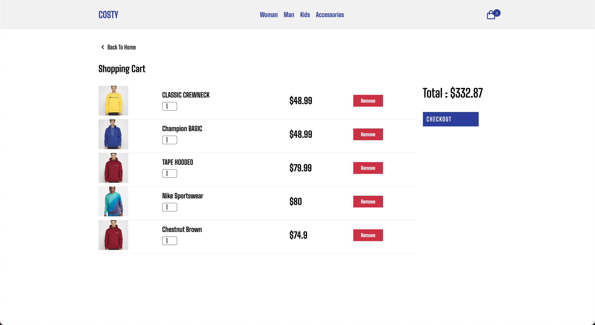
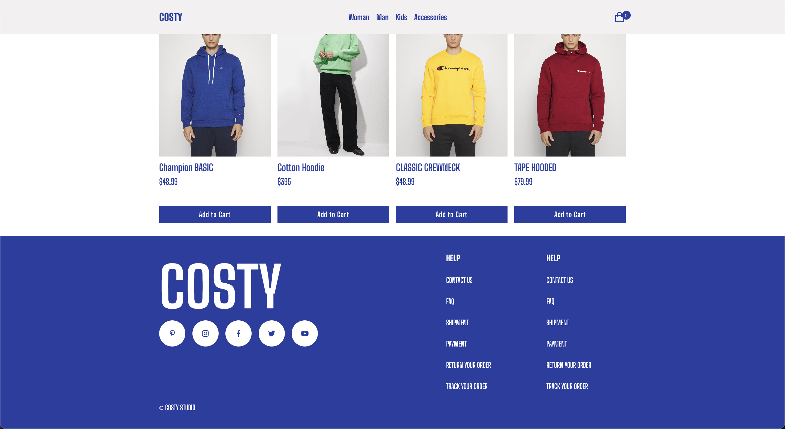

# E-CommerceProject

This project is a simple e-commerce application developed using JavaScript. It includes essential shopping features for a seamless user experience.

## Screenshots 🖼️

### Video GIF


### MainPage


### CartPage



### Footer



## Features

- Product Listing: Products are fetched from a db.json API and displayed.
- Add/Remove from Cart: Users can add products to the cart or remove them.
- Total Price Calculation: The total price of items in the cart is calculated automatically.
- Data Persistence: Cart data is saved using localStorage, ensuring it persists even after a page refresh.
- Styling: The user interface is styled using plain CSS

## Installation and Usage

1. Clone the repository:

```
git clone https://github.com/ozerbaykal/E-Commerce.git

```

2. Navigate to the project directory:

```
cd E-Commerce

```

3. Go live server

4. Open the index.html file in your browser to view the application.

## Technologies Used

- JavaScript: For core functionality.
- JSON Server: To simulate an API for product data.
- LocalStorage: To store user data locally.
- CSS: For styling the user interface.

## Development Process

This project was designed to provide a simple yet effective e-commerce experience. Future updates may include features like user authentication, a product details page, and support for more product categories.

Note: Ensure that db.json is running with JSON Server while using the application.

## Contributing

Contributions are welcome! Please open an issue first to discuss what you would like to change.

- 1.Fork the project
- 2.Create your feature branch (git checkout -b feature/NewFeature)
- 3.Commit your changes (git commit -m 'Add new feature')
- 4.Push to the branch (git push origin feature/NewFeature)
- 5.Open a Pull Request

## Contact 📬

**Özer BAYKAL**  
Email: [baykalozer87@gmail.com](mailto:baykalozer87@gmail.com)  
Project Link: [Movie App on GitHub](https://github.com/ozerbaykal/E-Commerce)
